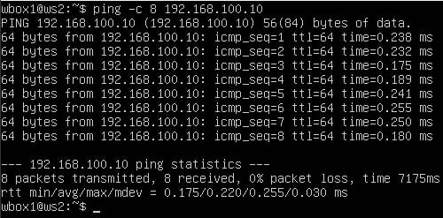
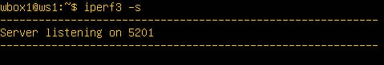
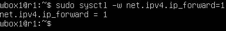

## Part 1. Инструмент **ipcalc**

#### 1.1. Сети и маски
- Командой `sudo apt install ipcalc` устанавливаем ipcalc

- Адрес сети `192.167.38.54/13`:
	
	
	
- Перевод маски `255.255.255.0` в перфиксную и двичную записи:
	
	
	
	Префиксная - `/24`
	Двоичная - `11111111.11111111.11111111. 00000000`

- `/15` в обычную и двоичную:
	
	
	
	Обычная - `255.254.0.0`
	Двоичная - `11111111.11111110.00000000. 00000000`
	
- `11111111.11111111.11111111.11110000` в обычную и префиксную:
	
	Это можно сделать вручную. В данном примере используется 28 бит:
	
	
	
	Обычная - `255.255.255.240`
	Префиксная - `/28`

- Минимальный и  хост в сети `12.167.38.4` при масках: `/8`, `11111111.11111111.00000000.00000000`, `255.255.254.0` и `/4`:
	
	- При маске `/8` 

	
	
	Минимальный - `12.0.0.1`
	Максимальный - `12.255.255.254`
	
	- Маска `11111111.11111111.00000000.00000000` равна 16 бит.
	
	
	
	Минимальный - `12.167.0.1`
	Максимальный - `12.167.255.254`
	
	- При маске `255.255.254.0`:
	
	
	
	Минимальный - `12.167.38.1`
	Максимальный - `12.167.39.254`

	- При маске `/4`:
	
	
	
	Минимальный - `0.0.0.1`
	Максимальный - `15.255.255.254`

#### 1.2. localhost
- Определи и запиши в отчёт, можно ли обратиться к приложению, работающему на localhost, со следующими IP: `194.34.23.100`, `127.0.0.2`, `127.1.0.1`, `128.0.0.1`

	Можно обращаться к адресам с пометкой - `Loopback`. Такие адреса находятся в промежутке `127.0.0.0 — 127.255.255.255`

	Пример:

	

	Можно использовать - 127.0.0.2, 127.1.0.1
	Нельзя использовать - 194.34.23.100, 128.0.0.1

#### 1.3. Диапазоны и сегменты сетей
- Какие из перечисленных IP можно использовать в качестве публичного, а какие только в качестве частных: `10.0.0.45`, `134.43.0.2`, `192.168.4.2`, `172.20.250.4`, `172.0.2.1`, `192.172.0.1`, `172.68.0.2`, `172.16.255.255`, `10.10.10.10`, `192.169.168.1`

	В IPv4 адресации существует несколько диапазонов адресов, зарезервированных для частной использования:

	10.0.0.0/8: Диапазон от 10.0.0.0 до 10.255.255.255
	172.16.0.0/12: Диапазон от 172.16.0.0 до 172.31.255.255
	192.168.0.0/16: Диапазон от 192.168.0.0 до 192.168.255.255

	Используя ipcalc, частный адрес обозначают пометкой - `Private Internet`
	
	Пример:

	

	Адреса зарезервированные под localhost тоже являются частными

	Итог:

	Публичные - `134.43.0.2`, `172.0.2.1`, `192.172.0.1`, `172.68.0.2`, `192.169.168.1`
	Частные - `10.0.0.45`, `192.168.4.2`, `172.20.250.4`, `172.16.255.255`, `10.10.10.10`	

- Какие из перечисленных IP адресов шлюза возможны у сети `10.10.0.0/18`: `10.0.0.1`, `10.10.0.2`, `10.10.10.10`, `10.10.100.1`, `10.10.1.255`

	

	Промежуток возможных адресов от `10.10.0.1` до `10.10.63.254`

	У сети `10.10.0.0/18` адресом шлюза могут быть - `10.10.0.2`, `10.10.10.10`, `10.10.1.255`

## Part 2. Статическая маршрутизация между двумя машинами
- Подними две виртуальные машины (далее -- ws1 и ws2)

	

- С помощью команды `ip a` посмотри существующие сетевые интерфейсы

	
	

- Опиши сетевой интерфейс, соответствующий внутренней сети, на обеих машинах и задать следующие адреса и маски: ws1 - `192.168.100.10`, маска `/16`, ws2 - `172.24.116.8`, маска `/12`

	
	
	

- Выполни команду `netplan apply` для перезапуска сервиса сети

	

	

#### 2.1. Добавь статический маршрут вручную
- Добавь статический маршрут от одной машины до другой и обратно при помощи команды вида `ip r add`

	
	
	
	
- Пропингуй соединение между машинами

	
	
	

#### 2.2. Добавь статический маршрут с сохранением
- Добавь статический маршрут от одной машины до другой с помощью файла _etc/netplan/00-installer-config.yaml_

	
	
	
	
- Пропингуй соединение между машинами

	
	
	

## Part 3. Утилита **iperf3**

#### 3.1. Скорость соединения
- Переведи и запиши в отчёт: 8 Mbps в MB/s, 100 MB/s в Kbps, 1 Gbps в Mbps
	8 Mbps = 1 MB/s
	100 MB/s = 800000 Kbps
	1 Gbps = 1000 Mbps

#### 3.2. Утилита **iperf3**
- Измерь скорость соединения между ws1 и ws2

	Используем сервер iperf3 на ws1

	

	Через ws2 подключаемся к серверу для измерения скорости
	
	

## Part 4. Сетевой экран

#### 4.1. Утилита **iptables**

- Создай файл `/etc/firewall.sh`, имитирующий фаерволл, на ws1 и ws2:

	
	
	

-  Запусти файлы на обеих машинах командами `chmod +x /etc/firewall.sh` и `/etc/firewall.sh`

	
	
	

	Теперь ws1 нельзя пинговать, а ws2 можно

#### 4.2. Утилита **nmap**
- Командой **ping** найди машину, которая не «пингуется», после чего утилитой **nmap** покажи, что хост машины запущен

	ws2 можно пропинговать

	

	ws1 нельзя пропинговать

	

	с ws2 видно что ws1 запущен

	

## Part 5. Статическая маршрутизация сети

#### 5.1. Настройка адресов машин

- Настрой конфигурации машин в _etc/netplan/00-installer-config.yaml_ согласно сети на рисунке.

	

	

	

	

	

- Перезапусти сервис сети. Если ошибок нет, то командой `ip -4 a` проверь, что адрес машины задан верно. Также пропингуй ws22 с ws21. Аналогично пропингуй r1 с ws11.

	

	

	

	

	

	Пропингуем ws22.

	

	Пропингуем r1.

	

#### 5.2. Включение переадресации IP-адресов.

-  Для включения переадресации IP, выполни команду на роутерах:

	`sysctl -w net.ipv4.ip_forward=1`

	

	

- Открой файл _/etc/sysctl.conf_ и добавь в него следующую строку:
	net.ipv4.ip_forward = 1

	

	

#### 5.3. Установка маршрута по-умолчанию

- Настрой маршрут по-умолчанию (шлюз) для рабочих станций. Для этого добавь `default` перед IP роутера в файле конфигураций

	

	

	

- Вызови `ip r` и покажи, что добавился маршрут в таблицу маршрутизации

	

	

	

- Пропингуй с ws11 роутер r2 и покажи на r2, что пинг доходит. Для этого используй команду: `tcpdump -tn -i eth0`

	

	

#### 5.4. Добавление статических маршрутов

- Добавь в роутеры r1 и r2 статические маршруты в файле конфигураций.

	

	

- Вызови `ip r` и покажи таблицы с маршрутами на обоих роутерах.

	

	

- Запусти команды на ws11: `ip r list 10.10.0.0/[маска сети]` и `ip r list 0.0.0.0/0`

	

- В отчёте объясни, почему для адреса 10.10.0.0/[маска сети] был выбран маршрут, отличный от 0.0.0.0/0, хотя он попадает под маршрут по-умолчанию.

	Маршрутизация работает на основе точного совпадения префиксов. Маршрут `0.0.0.0/0` является маршрутом по умолчанию, который используется для направления трафика, адрес которого не соответствует ни одному из других маршрутов в таблице

#### 5.5. Построение списка маршрутизаторов

- При помощи утилиты **traceroute** построй список маршрутизаторов на пути от ws11 до ws21

	Вызов команды `traceroute 10.20.0.10` на машине ws11
	

	Вызов команды `tcpdump -tnv -i eth0` на роутере r1

	

	Traceroute — это мощный инструмент для исследования сетевых маршрутов, который позволяет пользователям определить, как данные пакеты перемещаются от исходного компьютера до целевого хоста. Основная идея заключается в использовании специальных ICMP (Internet Control Message Protocol) пакетов для определения пути, по которому проходит трафик.

#### 5.6. Использование протокола **ICMP** при маршрутизации

- Запусти на r1 перехват сетевого трафика, проходящего через eth0 с помощью команды:
	`tcpdump -n -i eth0 icmp`

	

- Пропингуй с ws11 несуществующий IP (например, _10.30.0.111_) с помощью команды:

	`ping -c 1 10.30.0.111`

	

## Part 6. Динамическая настройка IP с помощью **DHCP**

- Для r2 настрой в файле _/etc/dhcp/dhcpd.conf_ конфигурацию службы **DHCP**:

	

- В файле _resolv.conf_ пропиши `nameserver 8.8.8.8`.

	

- Перезагрузи службу **DHCP** командой `systemctl restart isc-dhcp-server`. Машину ws21 перезагрузи при помощи `reboot` и через `ip a` покажи, что она получила адрес. Также пропингуй ws22 с ws21.

	

	

- Укажи MAC адрес у ws11, для этого в _etc/netplan/00-installer-config.yaml_ надо добавить строки: `macaddress: 10:10:10:10:10:BA`, `dhcp4: true`

	

- Для r1 настрой аналогично r2, но сделай выдачу адресов с жесткой привязкой к MAC-адресу (ws11). Проведи аналогичные тесты

	

	

	

- Запроси с ws21 обновление ip адреса

	До:

	

	После:

	

	Командой `sudo dhclient -r eth0` освободил ip адрес
	Командой `sudo dhclient eth0` запросил и получил новй ip адрес

## Part 7. **NAT**

- В файле _/etc/apache2/ports.conf_ на ws22 и r1 измени строку `Listen 80` на `Listen 0.0.0.0:80`, то есть сделай сервер Apache2 общедоступным

	

	

- Запусти веб-сервер Apache командой `service apache2 start` на ws22 и r1

	

	

- Добавь в фаервол, созданный по аналогии с фаерволом из Части 4, на r2 следующие правила:

1) Удаление правил в таблице filter - iptables -F;
2) Удаление правил в таблице "NAT" - iptables -F -t nat;
3) Отбрасывать все маршрутизируемые пакеты - iptables --policy FORWARD DROP.

	

	Используем команды `sudo chmod +x /etc/firewall.sh` и `sudo /etc/firewall.sh`

- Проверь соединение между ws22 и r1 командой `ping`, при запуске с этими правилами, ws22 не должна пинговаться с r1:

	

4) Разрешить маршрутизацию всех пакетов протокола **ICMP**

- Проверь соединение между ws22 и r1 командой `ping`, при запуске с этими правилами ws22 должна пинговаться с r1:

	

	

5) Включить **SNAT**, а именно маскирование всех локальных ip из локальной сети, находящейся за r2 (по обозначениям из Части 5 - сеть 10.20.0.0)

6) Включить **DNAT** на 8080 порт машины r2 и добавить к веб-серверу Apache, запущенному на ws22, доступ извне сети

	

- Проверь соединение по TCP для **SNAT**: для этого с ws22 подключиться к серверу Apache на r1 командой: `telnet [адрес] [порт]`

	

- Проверь соединение по TCP для **DNAT**: для этого с r1 подключиться к серверу Apache на ws22 командой `telnet` (обращаться по адресу r2 и порту 8080)

	

## Part 8. Дополнительно. Знакомство с **SSH Tunnels**

- Запусти на r2 фаервол с правилами из Части 7.

	

	Используем команды `sudo chmod +x /etc/firewall.sh` и `sudo /etc/firewall.sh`

- Запусти веб-сервер Apache на ws22 только на localhost (то есть в файле _/etc/apache2/ports.conf_ измени строку `Listen 80` на `Listen localhost:80`).

	

- Воспользуйся _Local TCP forwarding_ с ws21 до ws22, чтобы получить доступ к веб-серверу на ws22 с ws21

	Используем команду `ssh -L 1234:localhost:80 10.20.0.20`

	

	Проверяем подключение `telnet 127.0.0.1 1234`

	

- Воспользуйся _Remote TCP forwarding_ c ws11 до ws22, чтобы получить доступ к веб-серверу на ws22 с ws11

	В файрволе открыв порт 22 на вход и выход

	

	Открываем удаленное соединение на целевом хосте (ws22) с помощью команды `ssh -R 1234:localhost:80 10.10.0.2`

	

	Проверяем подключение

	